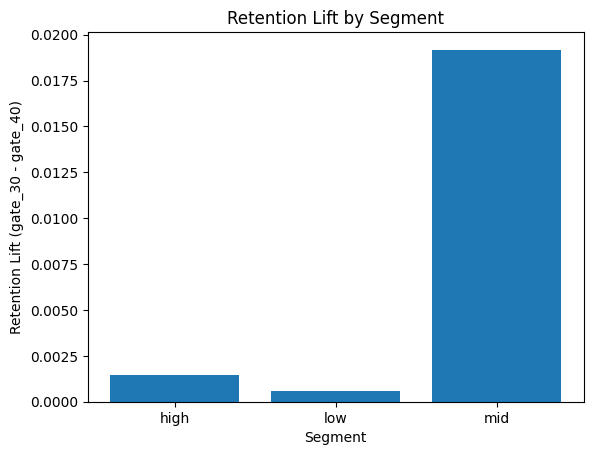

# Mobile Game A/B Test – Retention Optimization Case Study

## Objective

Evaluate whether moving the progression gate from level 40 to level 30 improves Day-7 retention.

## Dataset

* ~90,000 users

* Randomly assigned to two variants

* Key metric: retention\_7

## Overall Results

| Version | Retention\_7 |

| ------- | ----------- |

| gate\_30 | 19.02%      |

| gate\_40 | 18.20%      |

* Absolute lift: +0.82pp

* Relative lift: +4.5%

* p-value: 0.0015

* 95% CI: +0.31pp to +1.33pp

## Segment Analysis

Mid-engagement users (16–100 rounds) show the strongest impact

+1.92pp retention lift

p < 0.001

## Key Insight

The retention uplift is primarily driven by mid-engagement users, suggesting that earlier gating strengthens engagement among undecided users.

## Business Impact

At 1M monthly installs:

+8,200 additional retained users at Day-7.

